# Cryptocurrencies

  

## Table of Contents
* [Overview](https://github.com/rkaysen63/Cryptocurrencies/blob/master/README.md#overview)
* [Resources](https://github.com/rkaysen63/Cryptocurrencies/blob/master/README.md#resources)
* [Results](https://github.com/rkaysen63/Cryptocurrencies/blob/master/README.md#results)
* [Summary](https://github.com/rkaysen63/Cryptocurrencies/blob/master/README.md#summary)

## Resources:    
* Data: crypto_data.csv
  *  Data retrieved from https://min-api.cryptocompare.com/data/all/coinlist
* Tools: 
  * Python (Libraries: pandas, matplotlib, hvplot.pandas, plotly.express, sklearn.preprocessing, sklearn.decomposition, sklearn.cluster)
  * Jupyter Notebook
* "Crypto Currency" image is courtesy of: https://www.pexels.com/@alesiakozik
* Lesson Plan: UTA-VIRT-DATA-PT-02-2021-U-B-TTH, Module 18 Challenge

## Overview:
* The purpose of this analysis of cryptocurrency data is to determine which of the cryptocurrencies are on the trading market and how they can be grouped.  
* The analysis will be performed using unsupervised machine learning models.  
  * The data will be preprocessed to clean the data set, to reduce it to only cryptocurrencies that are traded, to create numeric variables for features, and to scale the features.  
  * Then 98 features will be reduced to three principal components using sklearn.decomposition.PCA in order to visualize the results in three dimensions.  
  * The cryptocurrencies will be clustered using sklearn.cluster.KMeans.
  * The results will be visualized through both an hvplot.table and scatter plots.

## Results:
* Data is loaded into a DataFrame using Pandas.

  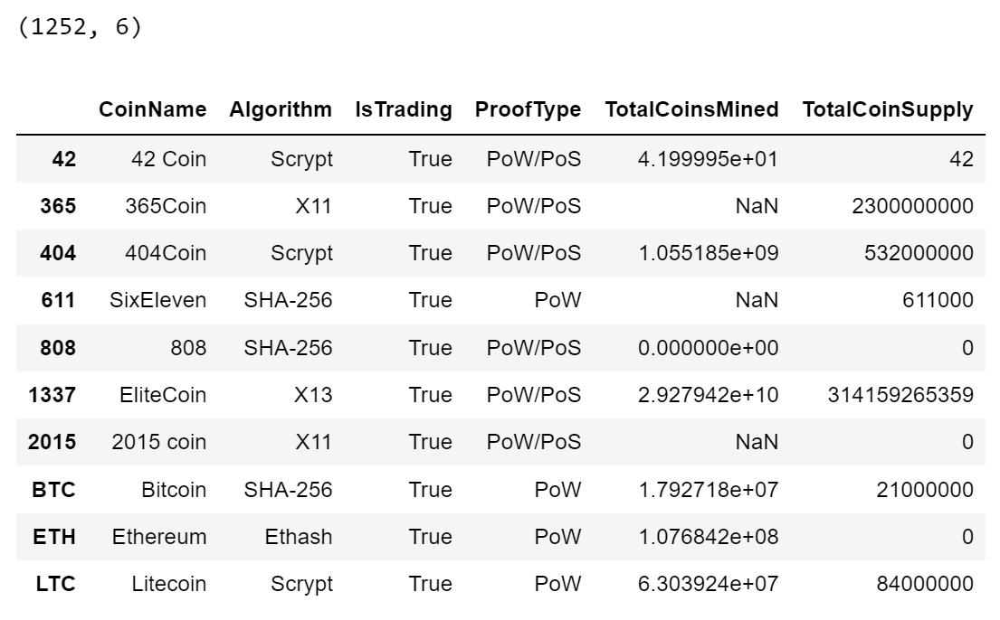   
  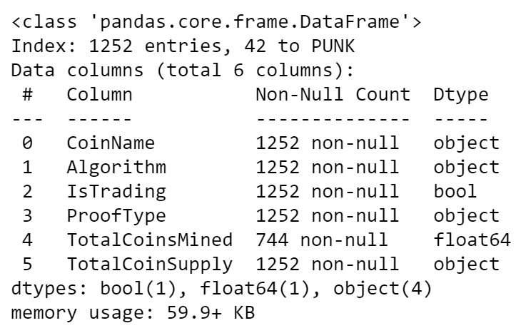

### Preprocessing the Data for PCA 
* Remove cryptocurrencies that are not being traded.   
  `crypto_df = crypto_df.loc[crypto_df["IsTrading"] == True,:]`   
* Drop "IsTrading" column.   
  `crypto_df = crypto_df.drop(columns="IsTrading")`   
* Remove all rows that have at least one null value.   
  `crypto_df = crypto_df.dropna()`   
* Remove all rows that do not have coins being mined.   
  `crypto_df = crypto_df[crypto_df["TotalCoinsMined"] > 0]`   
* Drop "CoinName" column.   
  `crypto_df = crypto_df.drop(columns="CoinName")`
  

  <a href="#">Cleaned DataFrame</a>  
  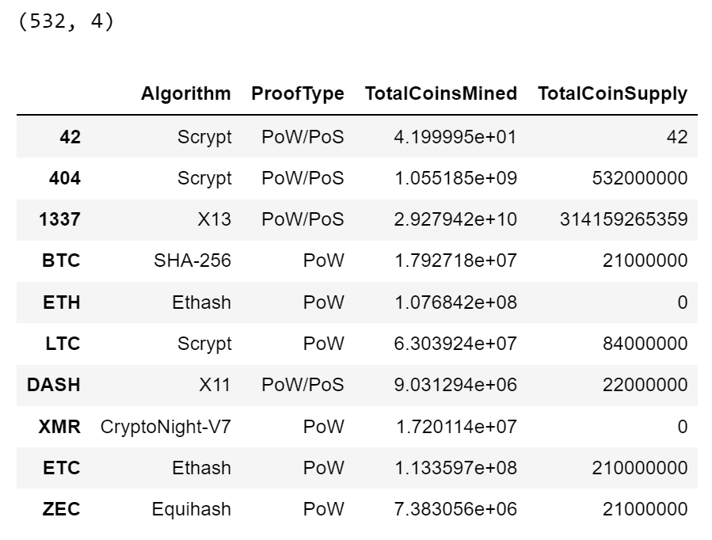 

   

* Store all cryptocurrency names in a DataFrame.   
  `names_df = crypto_df[["CoinName"]]`   

  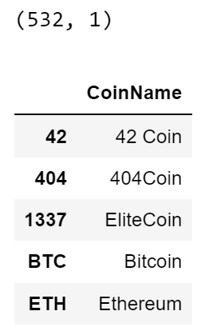

   

* Create Features DataFrame, X.  
  `X = pd.get_dummies(crypto_df, columns=["Algorithm","ProofType"])`  

  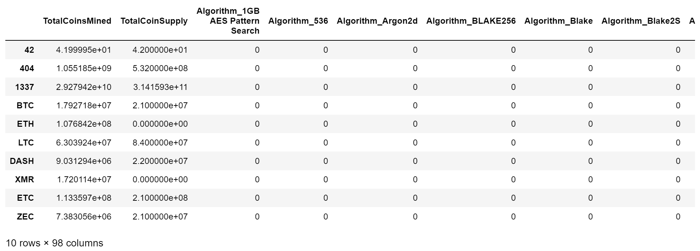

   

* Standardize features.   
  `X_scaled = StandardScaler().fit_transform(X)`   

### Reducing Data Dimensions Using PCA
* Using the PCA algorithm, reduce the dimensions of the X DataFrame down to three principal components.  
  `pca = PCA(n_components=3).fit_transform(X_scaled)`   
* Store principal components in a DataFrame.  
  `pca_df = pd.DataFrame(data=pca, columns=["PC 1","PC 2","PC 3"], index=X.index)`   

  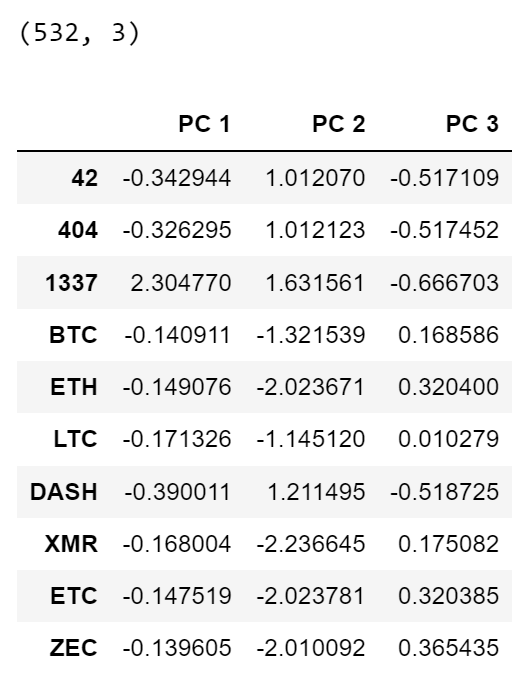

   

### Clustering Cryptocurrencies Using K-means
* Find best K value using an elbow curve.

      # Create an empty list to hold inertia values
      inertia = []

      # Store Values of K to Plot
      k = list(range(1, 11))

      #Loop through K values and find inertia
      for i in k:
          km = KMeans(n_clusters=i, random_state=0)
          km.fit(pca_df)
          inertia.append(km.inertia_)

      # Creating the Elbow Curve
      elbow_data = {"k": k, "inertia": inertia}
      df_elbow = pd.DataFrame(elbow_data)

      plt.plot(df_elbow['k'], df_elbow['inertia'])
      plt.xticks(list(range(11)))
      plt.title('Elbow Curve')
      plt.xlabel('Number of clusters')
      plt.ylabel('Inertia')
      plt.show()  

  <a href="#">Elbow Curve indicates best number of clusters, k=4.</a>
     
  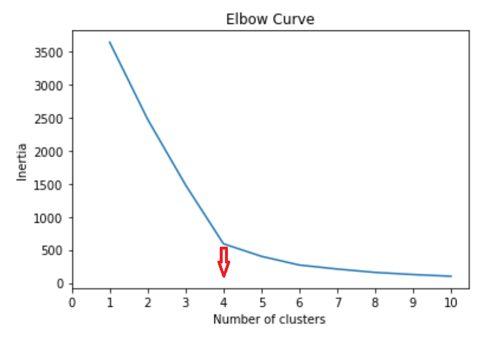

   

* Predict clusters using K-Means on PCA data.

      # Initialize the K-Means model.
      model = KMeans(n_clusters=4, random_state=0)

      # Fit the model
      model.fit(pca_df)

      # Predict clusters
      predictions = model.predict(pca_df)
      predictions  

* Create a new DataFrame is that has the following columns: Algorithm, ProofType, TotalCoinsMined, TotalCoinSupply, PC 1, PC 2, PC 3, CoinName, and Class.

      clustered_df = pd.concat([crypto_df, pca_df], axis=1).reindex(crypto_df.index)  
      clustered_df = pd.concat([clustered_df, names_df], axis=1).reindex(crypto_df.index)  

 
  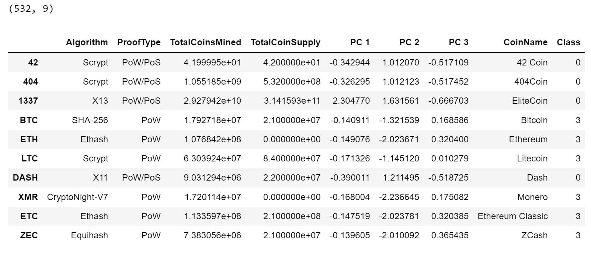

   

### Visualizing Cryptocurrencies Results 
* Plot clustered PCA data in 3D. 

      fig = px.scatter_3d(
          data_frame=clustered_df,
          x="PC 1",
          y="PC 2",
          z="PC 3",
          color="Class",
          symbol="Class",
          hover_name=clustered_df["CoinName"],
          hover_data=["Algorithm"],
          width=800
      ) 
      fig.update_layout(legend=dict(x=0, y=1))
      fig.show()   

  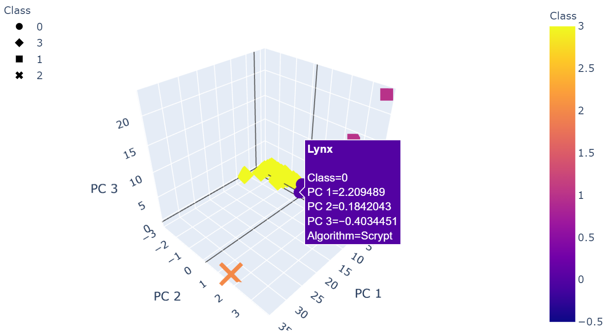
     
  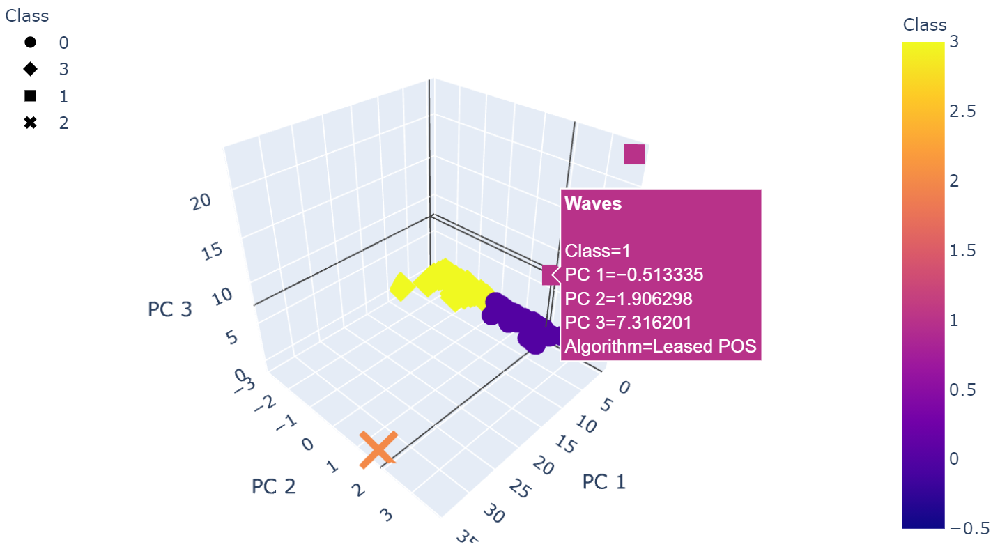
      
  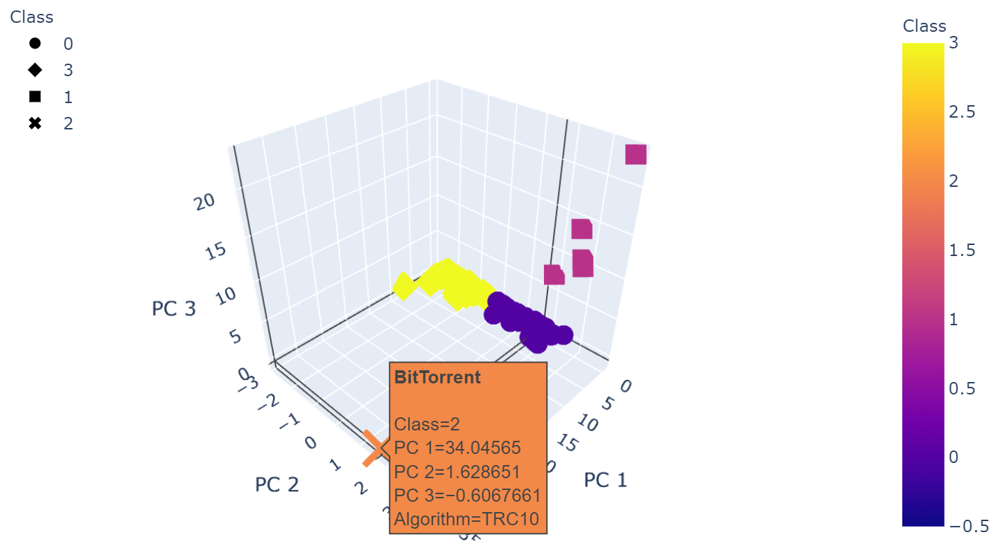
     
  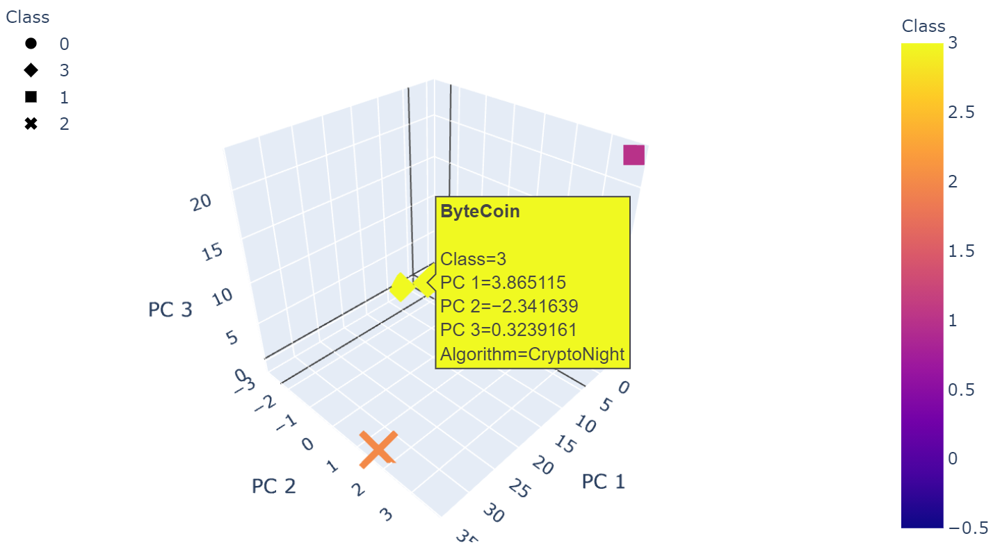
      

   

* Create table of tradable cryptocurrencies.

      clustered_df.hvplot.table(columns=['CoinName',
                                         'Algorithm',
                                         'ProofType',
                                         'TotalCoinSupply',
                                         'TotalCoinsMined',
                                         'Class'])  

  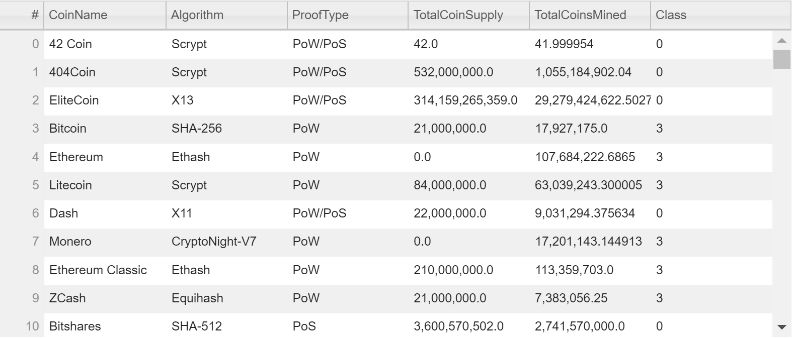

   

* Print the total number of tradable cryptocurrencies.

      num_tradable = len(clustered_df["CoinName"])
      print(f"There are {num_tradable} tradable cryptocurrencies.")  

  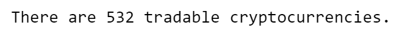

        
      
* Create a DataFrame, plot_df, that contains the clustered_df DataFrame index, the scaled data, and the CoinName and Class columns.

      # Scaling data to create the scatter plot with tradable cryptocurrencies.
      coin_count_cols_df = clustered_df[["TotalCoinSupply", "TotalCoinsMined"]].copy()
      coin_count_cols_scaled = MinMaxScaler().fit_transform(coin_count_cols_df)
      df_scaled = pd.DataFrame(data=coin_count_cols_scaled, columns=["TotalCoinSupply","TotalCoinsMined"], index=clustered_df.index)
      df1 = clustered_df[["CoinName", "Class"]].copy()
      plot_df = pd.concat([df_scaled, df1], axis=1).reindex(df1.index)  

  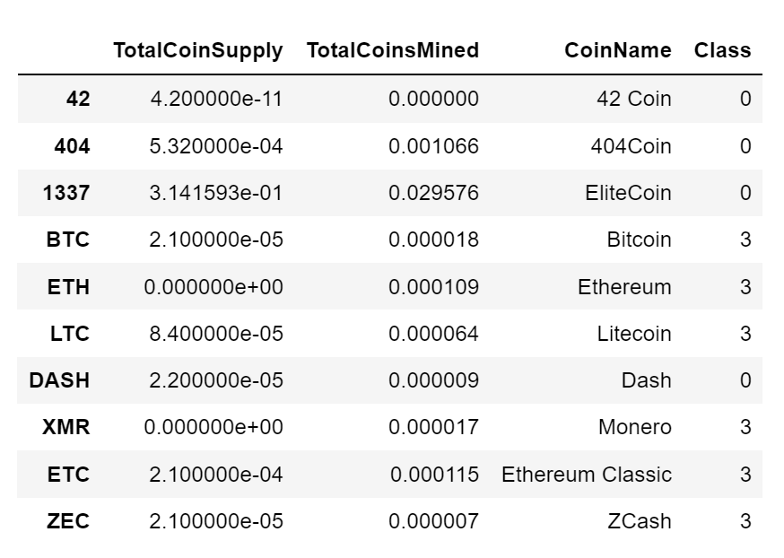

   

* Plot "TotalCoinsMined" vs "TotalCoinSupply", the data is ordered by "Class", using hvplot.scatter. 

      plot_df.hvplot.scatter(
          x="TotalCoinsMined",
          y="TotalCoinSupply",
          hover_cols=["CoinName"],
          by="Class"
      )   

  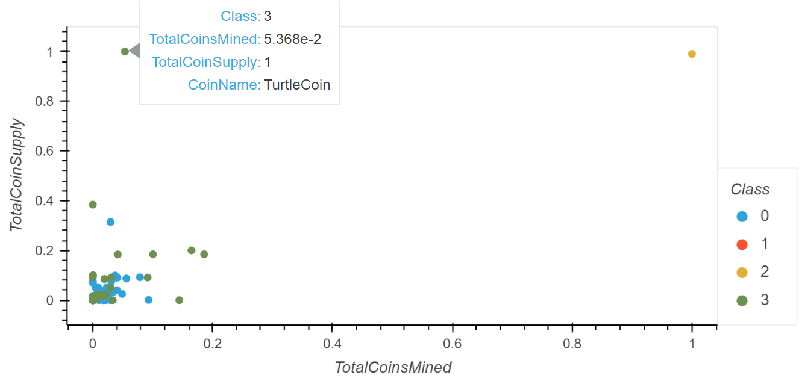

     

* Plot "TotalCoinsMined" by "TotalCoinSupply" by "Class" in 3D to differentiate the classes.

  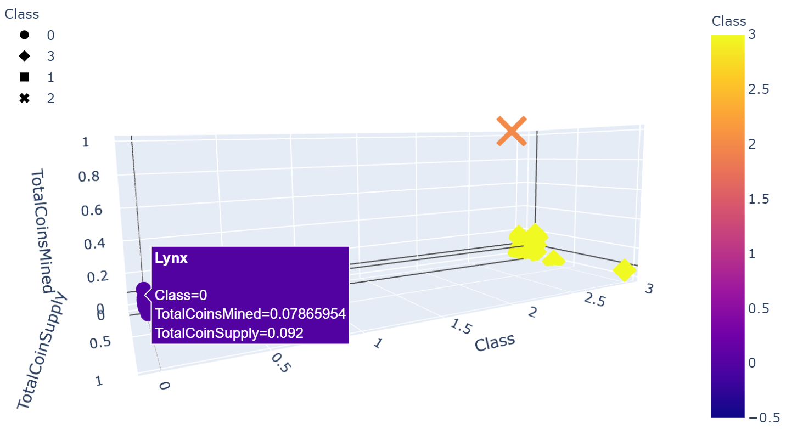
     
  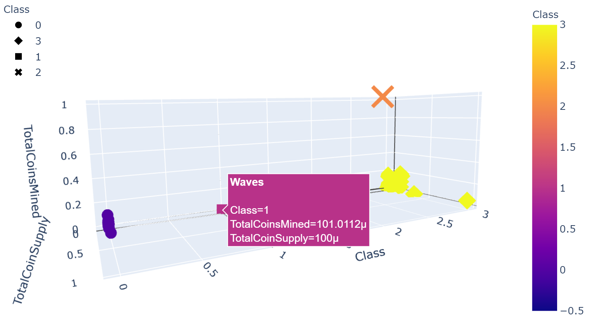
      
  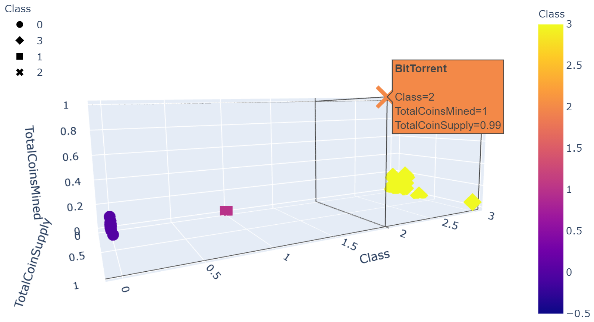
     
  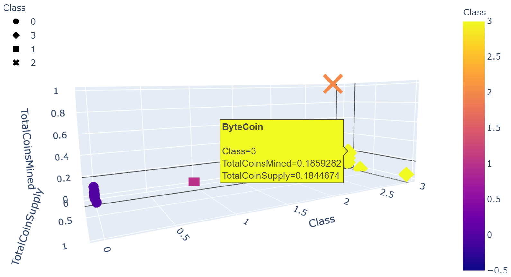
      

   

## Summary:
* The purpose of this analysis of cryptocurrency data is to determine which of the cryptocurrencies are on the trading market and how they can be grouped.  
* The analysis will be performed using unsupervised machine learning models.  
  * The data will be preprocessed to clean the data set, to reduce it to only cryptocurrencies that are traded, to create numeric variables for features, and to scale the features.  
  * Then 98 features will be reduced to three principal components using sklearn.decomposition.PCA in order to visualize the results in three dimensions.  
  * The cryptocurrencies will be clustered using sklearn.cluster.KMeans.
  * The results will be visualized through both an hvplot.table and scatter plots.
 Using machine learning model, sklearn

[Back to the Table of Contents](https://github.com/rkaysen63/Cryptocurrencies/blob/master/README.md#table-of-contents)
